# SalleFondVert_Controller

**Ou comment utiliser plus ou moins en autonomie les lights de la salle fond vert avec Chataigne.**

<!-- Le patch sur Chataigne : modifier les variables dans Chataigne pour les renvoyer en OSC ? et notamment pouvoir rallumer après un blackout ?
Blackout c'est un toggle ?

L'interface Android sur PureData puis Processing.

Faire une explication de l'interface et de ce qui controle quoi,  + photo
-->

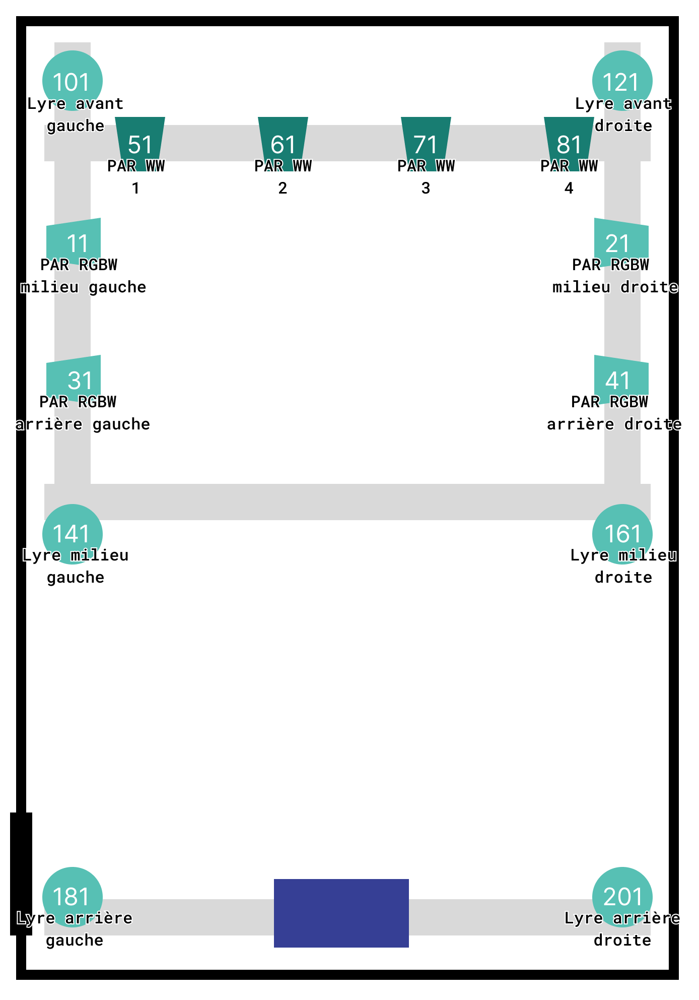

Le patch DMX complet de l'installation actuelle de la salle fond vert, avec l'adresse DMX de chaque paramètre de chaque fixture, se trouve dans le pdf `Patch complet salle fond vert`.

Étape 1 : allumer les lights avec les interrupteurs "prises" à droite de la porte.

## Créer une conduite lumière dans Chataigne

La timeline permettant de créer des séquences se trouve en bas de l'interface :

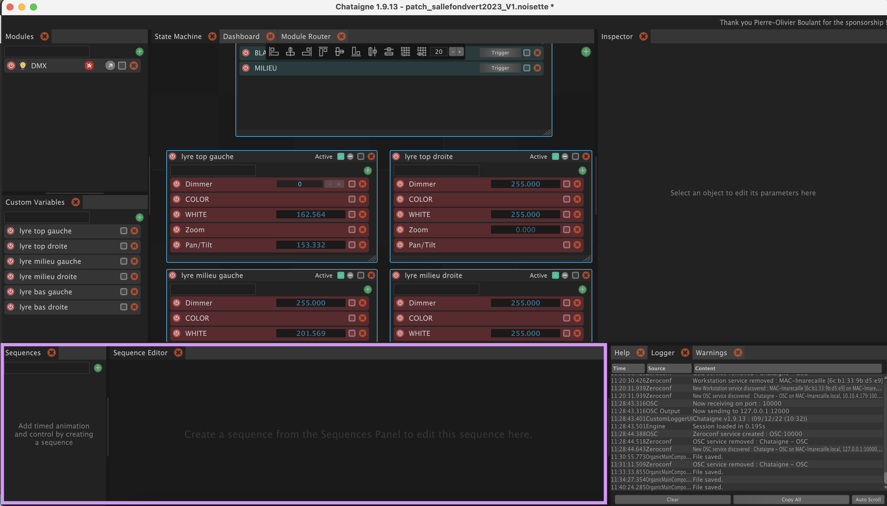

On clique sur le bouton ➕ vert dans la partie `Sequences`.

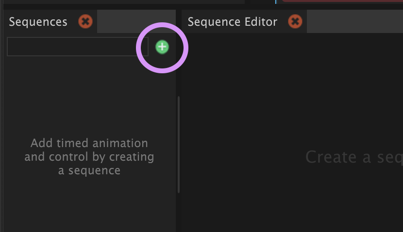

Cette séquence correspond à une lecture de la timeline, sur laquelle plusieurs automations de paramètres pourront être lues en même temps.

On clique sur le bouton ➕ vert dans la partie `Sequence Editor` pour créer une première automation.

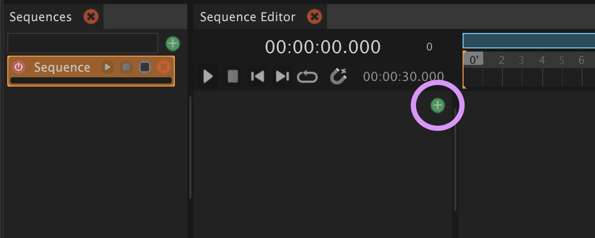

On peux choisir le type d'automation :
- `Trigger` déclenchera des évenements sans transition, en envoyant une valeur à un moment donné de la timeline. Ça sert par exemple à éteindre tous les lights d'un coup.
- `Mapping` permet de modifier une valeur suivant une courbe. Ça sert par exemple à faire tourner lentement une lyre ou baisser progressivement la luminosité.
- `Mapping 2D` est comme Mapping, mais en 2D permet de modifier une valeur suivant un chemin 2D. Plus d'infos [ici](https://bkuperberg.gitbook.io/chataigne-docs/v/fr/the-time-machine-sequences/mapping-2d-layer).
- `Audio` permet de synchroniser une piste son à la séquence, mais nécessite une carte son. Ça sert par exemple à avoir des sons qui se jouent en même temps que les animations.
- `Color` permet de faire évoluer une couleur dans le temps. Ça sert par exemple à créer des transitions de couleurs des lyres.
- `Sequences` permet de faire jouer plusieurs séquences en même temps ou sur la même timeline. Ça sert par exemple à créer plusieurs séquences d'animations de paramètres puis à les assembler dans le temps.

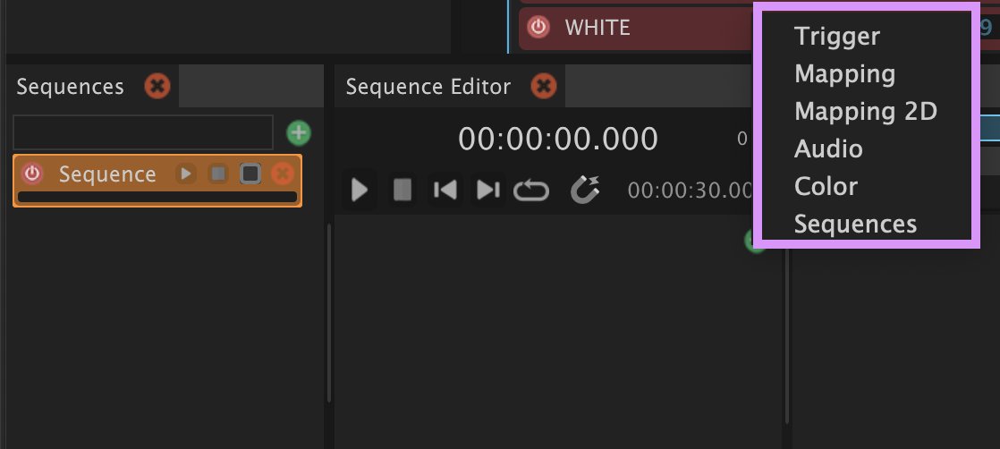

### Mapping de valeur

**1 : Créer le mapping de valeur**

On choisit `Mapping` : comme on travaille avec du DMX, on peux commencer par modifier la `Range` (de base de 0 à 1) en 0 à 255. Si on le fait après avoir placé des points, il faut d'abord choisir `Range Remap Mode` > `Proportional` pour que les points se replacent de manière proportionnelle sur la nouvelle range.

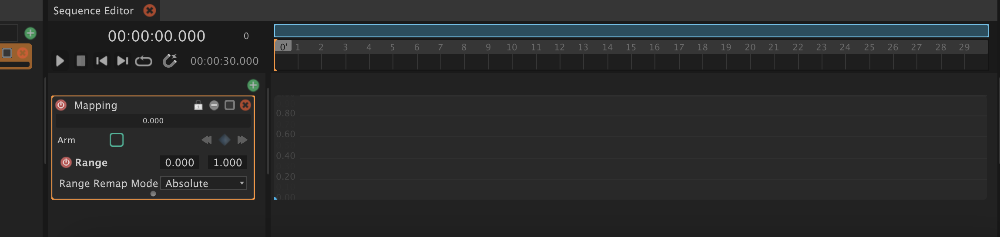

**2 : Enregistrer la courbe de valeur**

Il y a plusieurs méthodes pour placer des points dans la séquence. La première est de **dessiner directement sur la timeline** de l'automation, en maintenant `ctrl`+`shift` enfoncées et en faisant glisser la souris en cliquant.

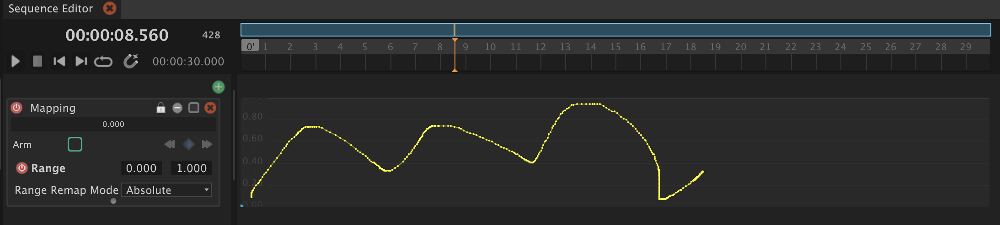

Lorsqu'on relâche le clic, le tracé jaune devient des courbes avec des points modifiables pour finaliser la courbe d'automation.

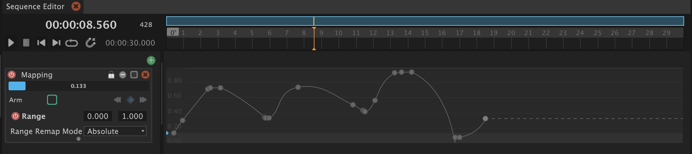

On peux aussi brancher un contrôleur midi (voir [la mise en place du midi](###-La-mise-en-place)), et **créer la courbe d'automation en enregistrant la valeur midi**.

Pour ça, il faut aller dans l'inspecteur, en haut à droite.

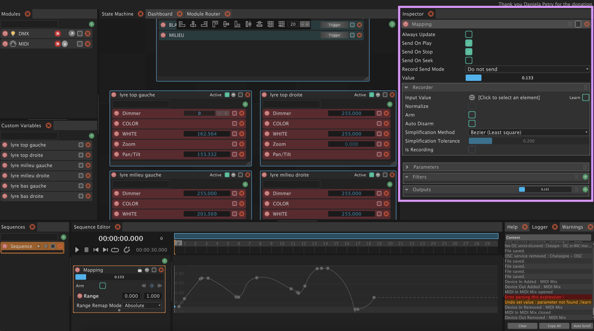

Dans la partie `Recorder`, cliquer sur `Learn` et toucher un des boutons/slider/potards du controleur midi pour que Chataigne détecte la modification d'une des valeurs midi et assigne la valeur au module `Recorder`.

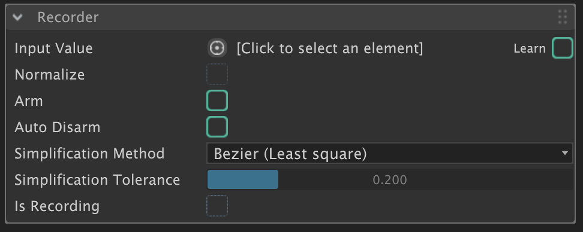

Ensuite, cocher `Arm` dans le `Recorder` ou directement dans la timeline, lancer la lecture de la timeline et toucher le même bouton/slider/potars du controleur midi pour créer une courbe à partir des valeurs midi reçues.

La courbe est rouge pendant l'enregistrement, puis devient une courbe aux points modifiables lorsqu'on met pause au défilement de la timeline.

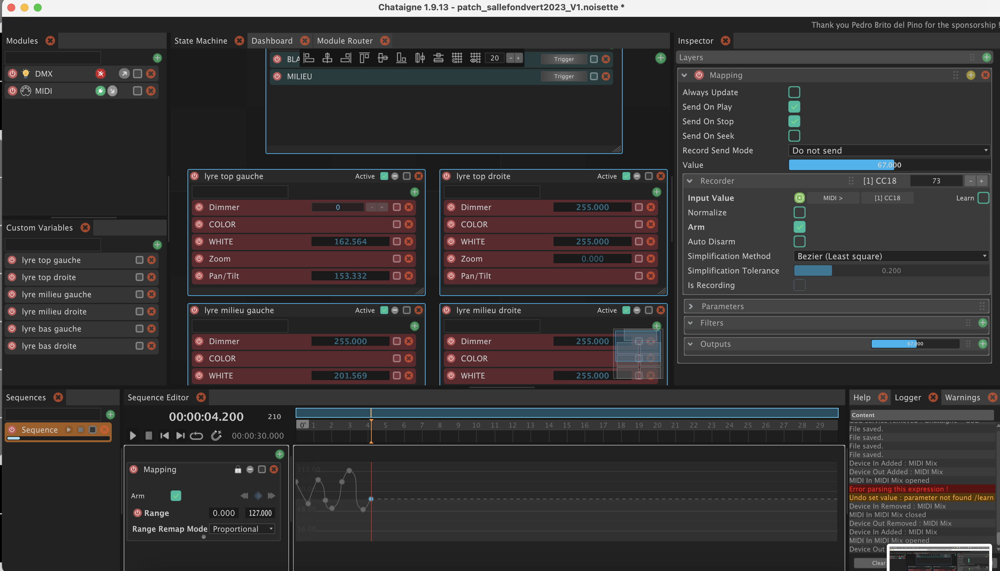

⚠️ Les données reçues en midi seront entre 0 et 127, le mieux est donc de mettre la `Range` entre 0 et 127, enregistrer avec le midi, puis choisir `Range Remap Mode` > `Proportional`, et changer la `Range` entre 0 et 255.

**3 : Assigner le mapping de valeur**

Dans l'inspecteur, on peux ajouter un ou plusieurs outputs à la courbe de valeur. Toutes les automations peuvent être appliquées à plusieurs paramètres ou plusieurs DMX par exemple.

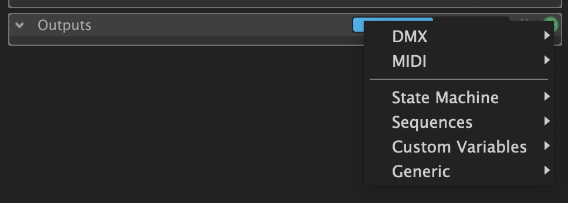

J'ai par exemple ici deux manières d'assigner ma courbe de valeur à la valeur de white de la lyre top gauche : soit en assignant directement au channel DMX, soit en l'assignant à la Custom Variable que j'ai crée pour ce paramètre.

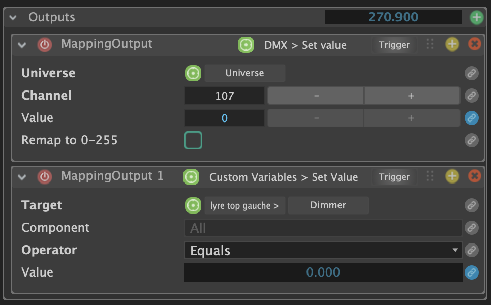

### Courbe de couleur

**1 : Créer l'évolution de couleurs**

En choisissant `Color`, la couleur de base est rouge sur toute la timeline.

Pour ajouter des couleurs, il suffit de double-cliquer sur la timeline pour ajouter des points déplaçables.

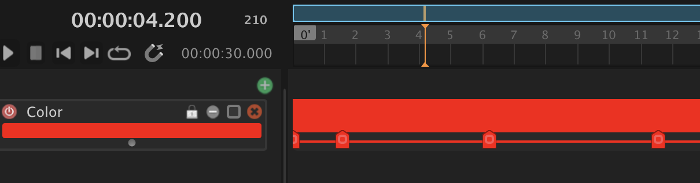

On peux ensuite modifier la couleur de ces points en cliquant dessus, puis en allant dans l'inspecteur (en haut à droite) et en double-cliquant sur le carré tout en haut à droite :

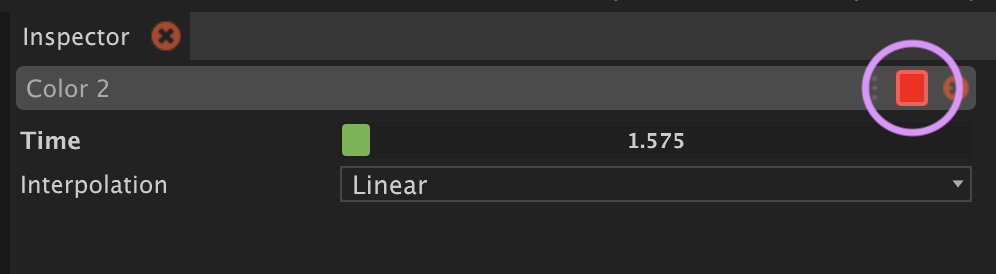

On peux alors choisir la couleur exacte, l'opacité, et donner le code hex de la couleur si besoin.

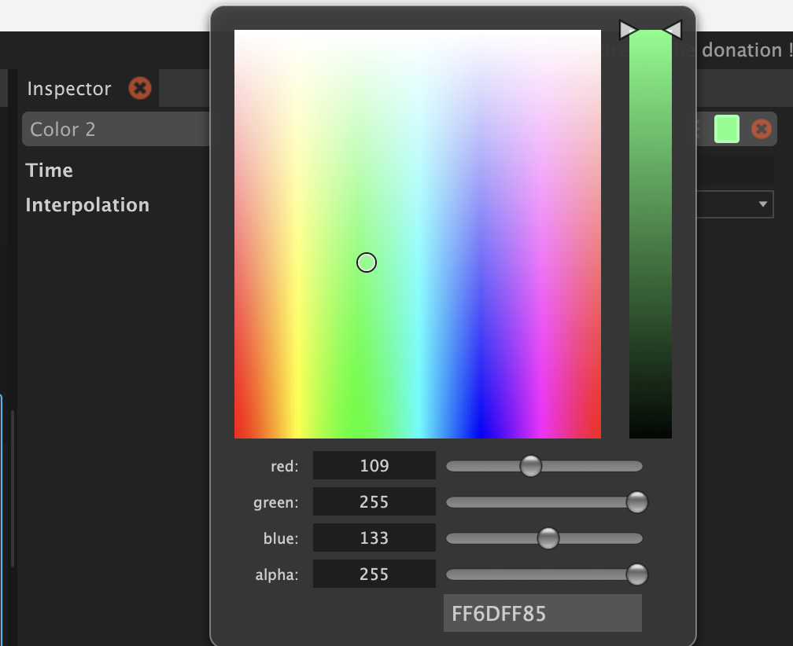

Dans l'inspecteur, on peux également modifier la position exacte de la couleur sur la timeline avec `Time`, et la transition avec la couleur suivante avec `Interpolation` (Linear = dégradé, None = pas de transition).

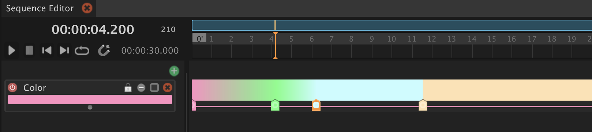

**2 : Assigner l'évolution de couleurs**

Dans la partie `Outputs` de l'inspecteur, on peux assigner la couleur aux lights de deux manières :
- Soit directement en DMX, avec `Set Color` et en choisissant le channel de départ de la couleur (le channel de la valeur de rouge, le suivant sera toujours la valeur de vert puis la valeur de bleu), ici 109 pour la lyre top gauche :

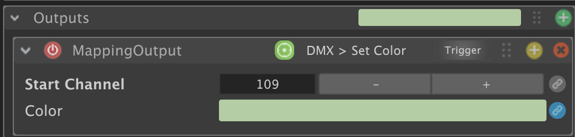

- Soit en assignant aux Custom Variables de chaque couleur :

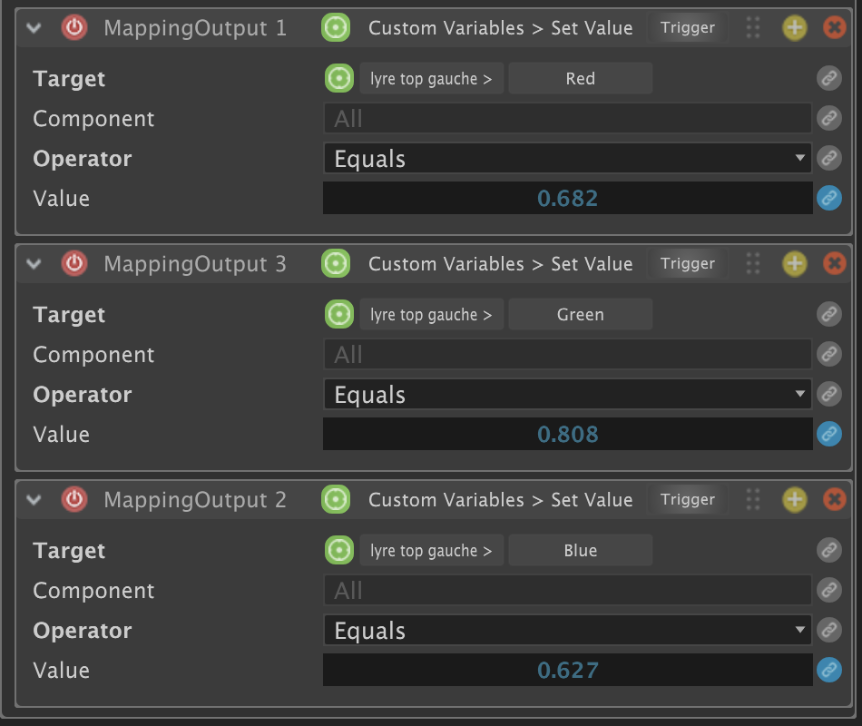

Pour celà, dans la ligne `Value`, il faut cliquer sur le petit symbole lien 🔗 et choisir la couleur correspondante.

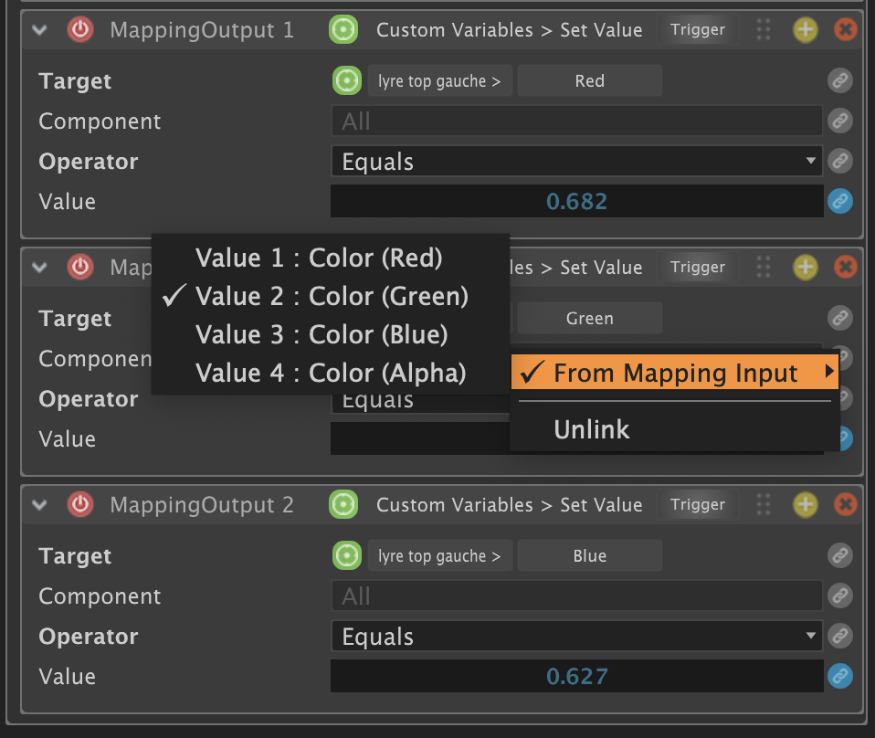

## Le midi-learn dans Chataigne

Pour contrôler certains paramètres avec un controleur MIDI, en faisant automatiquement l'attribution de la valeur midi au paramètre à modifier.

### La mise en place

J'utilise ici un Midimix, avec 24 potards, 9 sliders et 20 boutons.

Pour utiliser un controleur midi, on ajoute un module MIDI dans la partie Modules à gauche de l'interface de Chataigne.

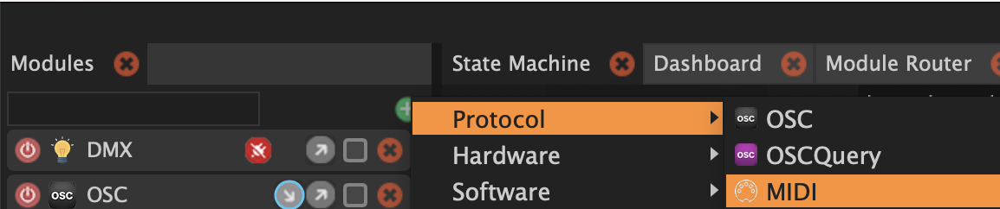

Dans l'inspecteur du module, on peux alors choisir notre controleur midi.

Lorsque que `Auto Add` est coché, et `Is Connected` est activé, on voit les valeurs changer en temps réel dans la partie Values de l'inspecteur.

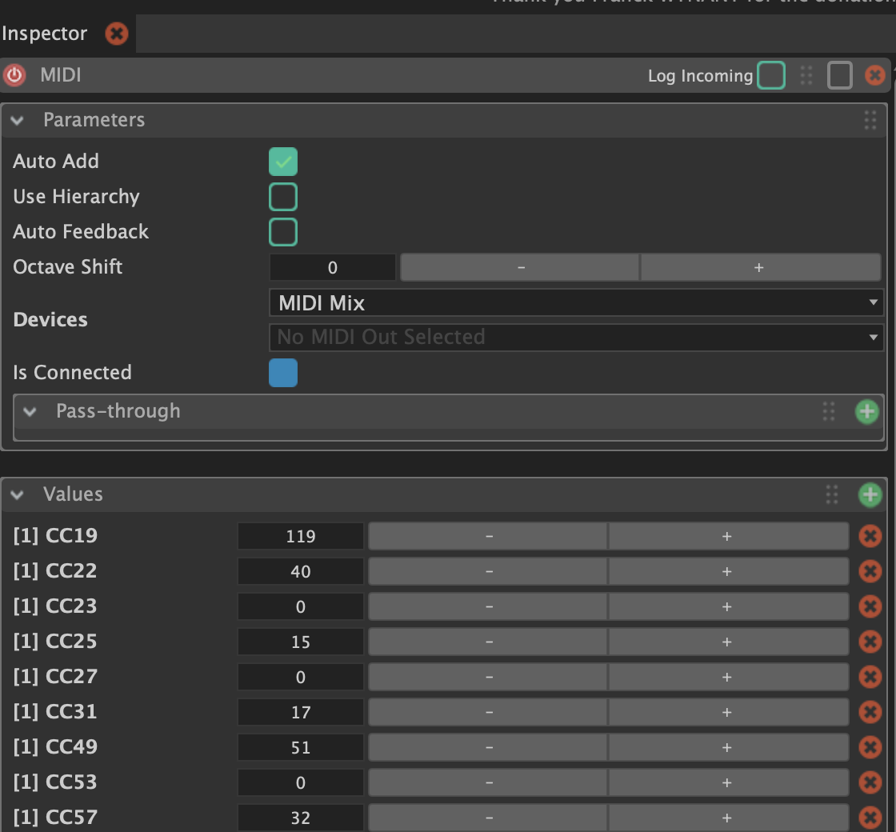

### Ajouter le contrôle

Pour assigner une valeur midi à un channel DMX/paramètre, il suffit de cliquer sur le mapping du paramètre. Ici, le dimmmer du projecteur PAR WW face :

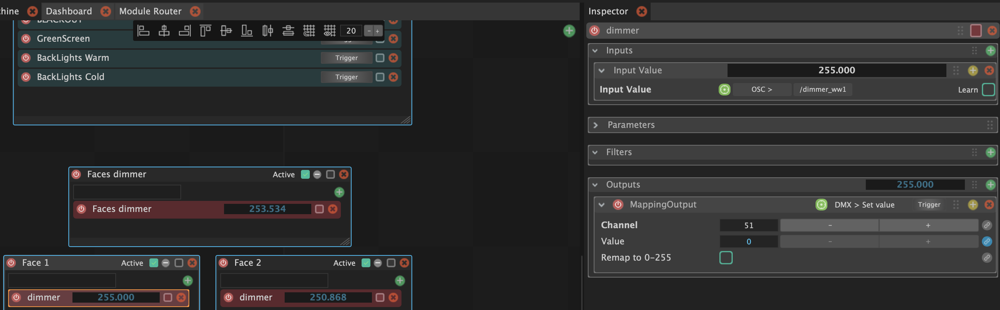

Dans la partie Inputs de l'inspecteur, il suffit de créer un nouvel input en cliquant sur le bouton ➕ en haut à droite de la partie Inputs.

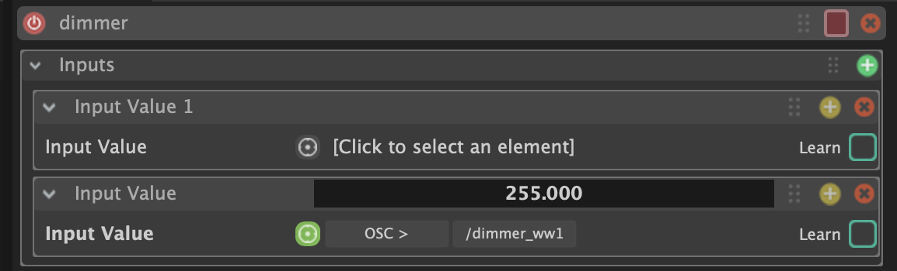

En cliquant sur le carré `Learn` à droite puis en touchant le controleur midi pour modifier une valeur, la valeur midi s'attribue automatiquement à la valeur du mapping et donc du paramètre (ici la valeur de CC19).

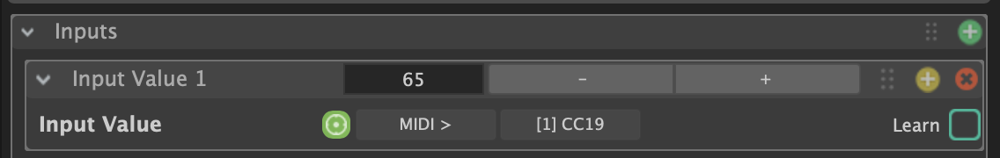

⚠️ Le controleur midi envoit des valeurs de 0 à 127, et le DMX reçoit des valeurs de 0 à 255. 
Si on ne remappe pas les valeurs reçues en midi, tous les paramètres ne seront "qu'à moitié" : envoyer le max de brightness avec le controleur ne résultera qu'à une luminosité moyenne sur la light, le pan max de la fixture ne sera qu'à la moitié de l'axe, et ainsi de suite.

Il faut donc remapper les valeurs de l'input pour qu'elle sorte en output en allant de 0 à 255.
Pour cela, on ajoute un filtre en cliquant sur le bouton ➕ de la partie Filters, Remap > Remap.

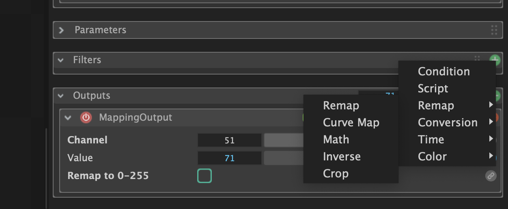

On assigne la plage d'entrée allant de 0 à 127 et la plage de sortie allant de 0 à 255.

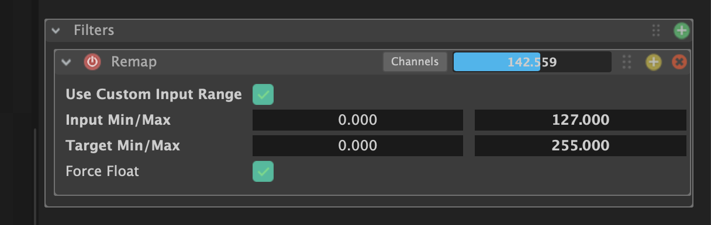

⚠️ Le controle midi devrait être le premier input de la liste des inputs si il y en a d'autres et qu'on veux le controle midi soit prioritaire.

## Pour aller + loin

Le [tuto introduction à Chataigne](https://github.com/LucieMrc/Chataigne_2spi).