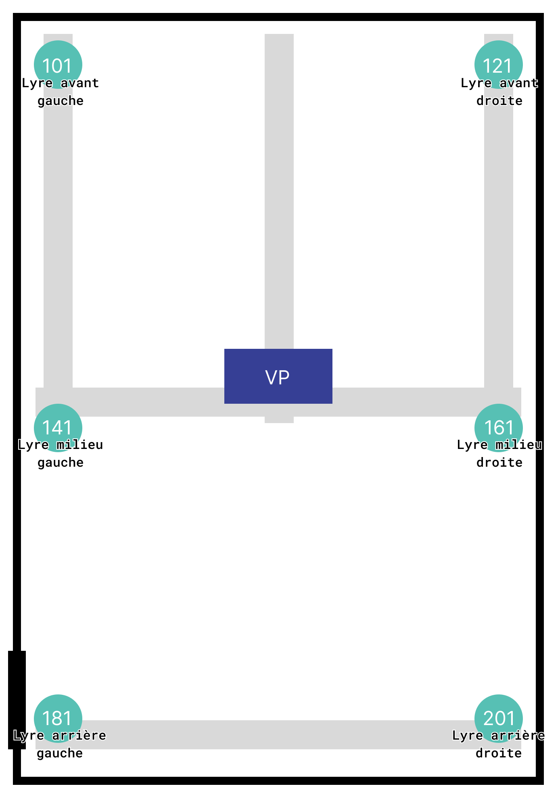

# SalleFondVert_Controller

**Ou comment utiliser plus ou moins en autonomie le controleur light de la salle fond vert qui fait tablette(OSC) > ordinateur (Chataigne) > lights (DMX).**

<!-- Le patch sur Chataigne : modifier les variables dans Chataigne pour les renvoyer en OSC ? et notamment pouvoir rallumer après un blackout ?
Blackout c'est un toggle ?

L'interface Android sur PureData puis Processing.

Faire une explication de l'interface et de ce qui controle quoi,  + photo

-->

 