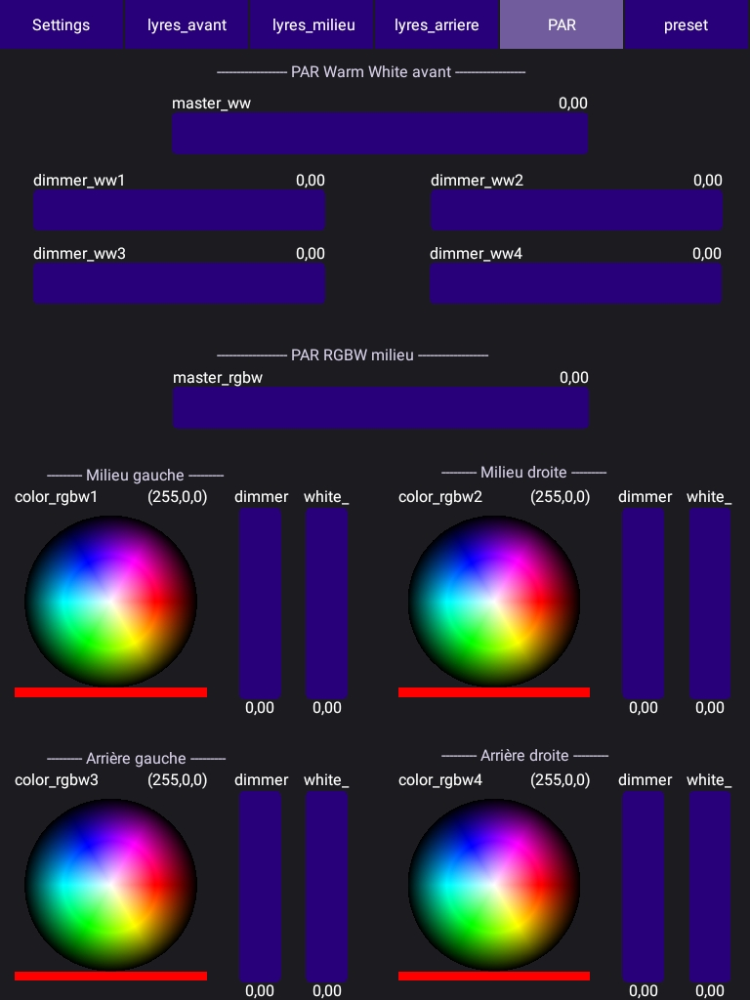

# SalleFondVert_Controller

**Ou comment utiliser plus ou moins en autonomie le controleur light de la salle fond vert qui fait tablette(OSC) > ordinateur (Chataigne) > lights (DMX).**

<!-- Le patch sur Chataigne : modifier les variables dans Chataigne pour les renvoyer en OSC ? et notamment pouvoir rallumer après un blackout ?
Blackout c'est un toggle ?

L'interface Android sur PureData puis Processing.

Faire une explication de l'interface et de ce qui controle quoi,  + photo
-->

## Utilisation de la tablette de contrôle lumière

### A. Interface

Les réglages de connexion :

- Le bouton `Scan` cherche les clients OSC (qui envoit le message /id), 
- Le bouton `Connect` se connecte quand on trouve un client,
- Le bouton `Broadcast` envoit les messages OSC à tous les clients du réseau.

Le plus simple est de cliquer juste sur `Scan` puis `Broadcast`.

Les contrôles des lyres avant (101 et 121), milieu (141 et 161) et arrière (181 et 201) :

- Le sélecteur de couleurs qui envoit les messages R, G et B,
- Le slider du blanc,
- Le slider du zoom qui permet de choisir le focus/zoom de la lyre,
- Le pad du pan/tilt qui permet d'orienter la lyre,
- Le slider du dimmer pour choisir la luminosité.

Les contrôles des PAR à l'avant (51, 61, 71 et 81) et des PAR du milieu (11, 21, 31 et 41) :

Les PAR de l'avant sont des Warm White (blanc chaud) dont on ne contrôle que le dimmer (luminosité), une par une ou toutes en même temps avec le master, avec des sliders.

Les PAR du milieu sont des RGBW (Red Green Blue White) dont on contrôle la luminosité de tous avec le slider master, et les paramètres :
- Le sélecteur de couleurs qui envoit les messages R, G et B,
- Le slider du dimmer pour choisir la luminosité,
- Le slider du blanc.

Les presets :

- Le Blackout pour tout éteindre,
- Les PAR milieu : un réglage Warm pour une lumière harmonieuse chaude et un Cold pour une lumière harmonieuse froide.
- Le Greenscreen pour une lumière uniforme sur le fond vert pour faire du chromakey.

### B. Mise en route

Allumer l'ordinateur, ouvrir le patch Chataigne, et vérifier la connexion de la tablette à Chataigne.

L'ordinateur de la salle fond vert doit être connecté sur le même réseau wifi que la tablette afin qu'ils puissent communiquer en OSC, le plus simple est d'utiliser le réseau du HUAWEI.

Il n'y a normalement pas besoin de modifier les paramètres OSC dans Chataigne, mais on peux vérifier qu'on détecte bien une adresse IP en 192.168.x.x (ici : 192.168.8.107) dans la partie OSC Input.

On peux aussi vérifier qu'on reçoit bien des messages OSC dans la partie Logger en bas à droite de l'interface Chataigne. Ici on reçoit le message /id du bouton `Scan` de la première interface.

## Utilisation de l'interface desktop

### A. Interface

Même principe que pour l'interface tablette.

Une première interface avec les réglages de connexion :

Une seconde interface avec les contrôles de 6 lyres :

Une dernière interface avec les controles des 8 PAR, les 4 WW qui éclairent le fond vert et les 4 RGBW du milieu, ainsi que les presets :

### B. Mise en route

Ouvrir le programme Processing `osc_controller_interface`, ainsi que le patch Chataigne.

Pas besoin de se poser des questions de réseau wifi étant donné que Chataigne et Processing communiquent directement en local en OSC.

Il n'y a normalement pas besoin de modifier les paramètres OSC dans Chataigne, qui sont en adéquation avec ceux écrit dans le code Processing.

On peux vérifier qu'on reçoit bien des messages OSC dans la partie Logger en bas à droite de l'interface Chataigne. Ici on reçoit le message /id du bouton `Scan` de la première interface.

